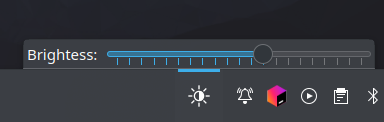
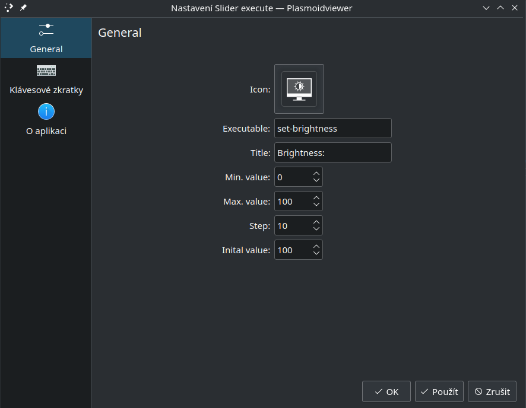

# Plasma 5 slider applet

Widget for customizable slider. 

Any command you set will always be executed after the value in the slider is changed. The value is passed as a parameter.

Executable from example is called as `set-brightness <value>`